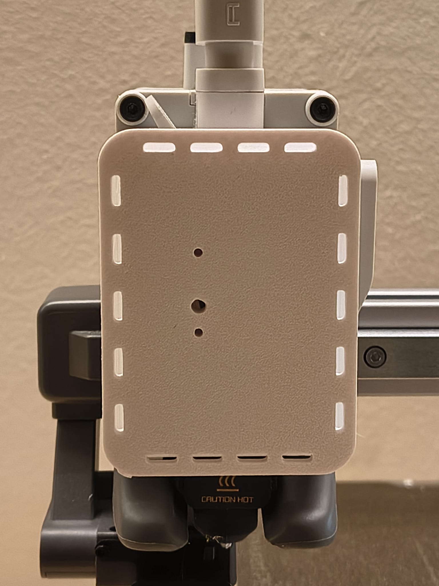
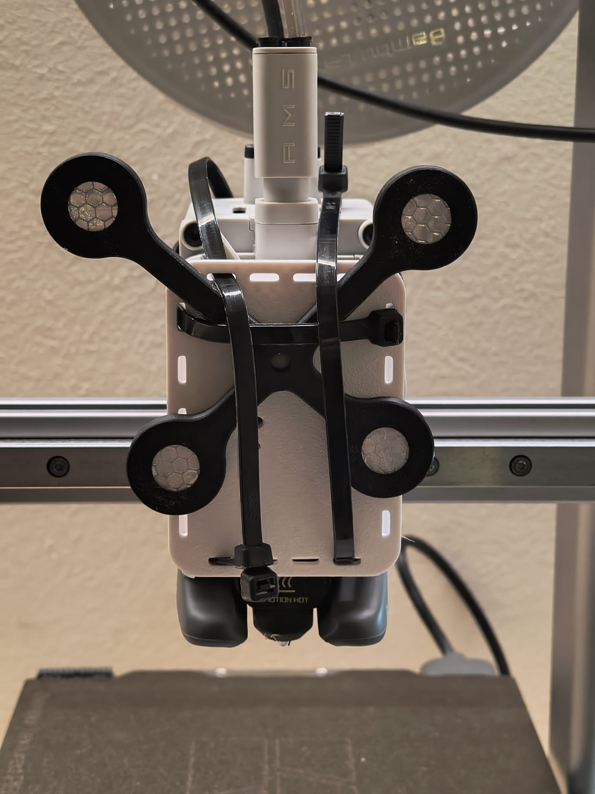
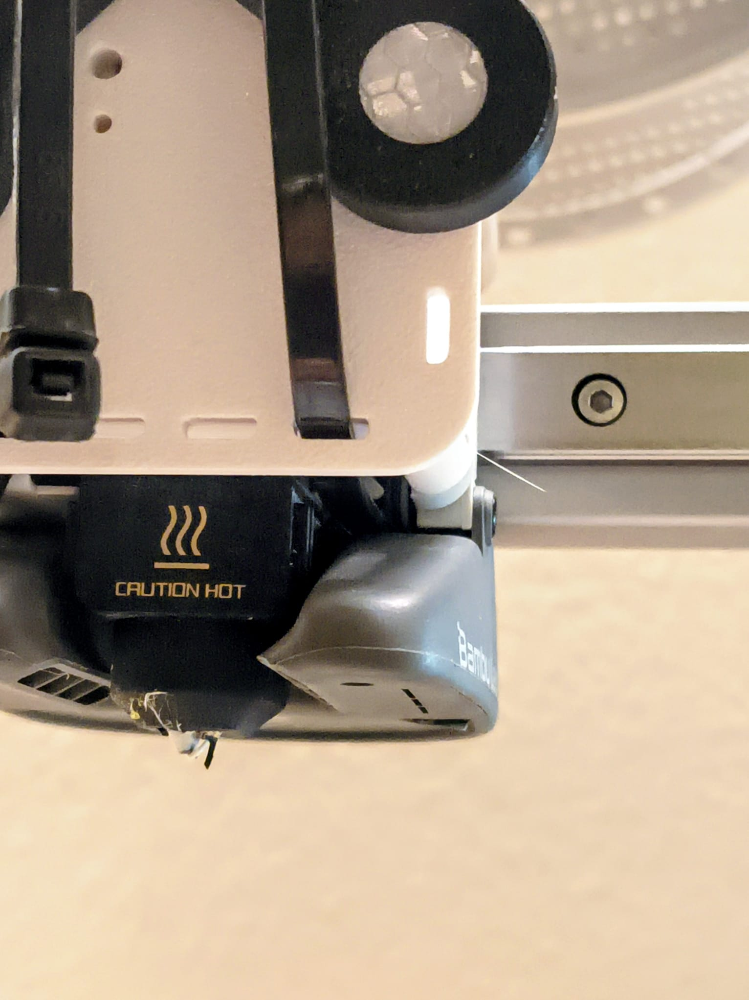
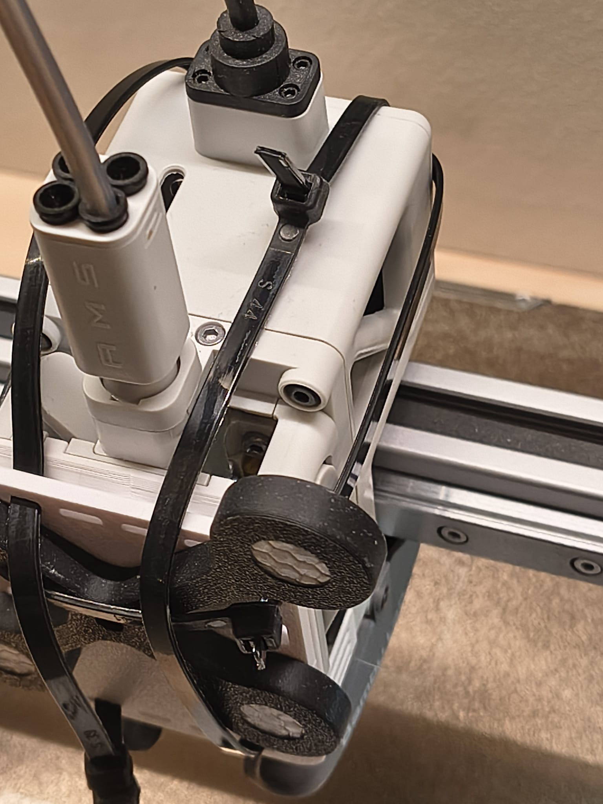

# Bambu Lab A1 mini files
Last updated: 11/01/2026

For the Bambu Lab A1, remove the front cover and the yellow rotating extruder indicator. 
If you have the original NDI markers and clamp mount, attach as shown below:

Shown below is a 'screw on' faceplate for the Atracsys Tindax 305 marker.

The images below demonstrate how to secure the mount using zip ties. Any method of fixating the markers to the extruder that eliminates all (sub-mm)wobble is sufficient. This is just an example.

