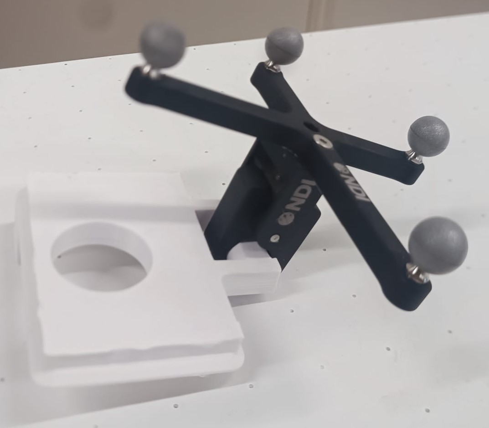

# 3DTrackBench Documentation

3DTrackBench is a standardized framework for benchmarking Extended Reality (XR) and surgical tracking systems using consumer 3D printers as deterministic motion platforms. In this experiment we would like to validate this accross different 3D printers and international collaborators. Thank you for participating! 

## Core Principle
Consumer 3D printers offer sub-millimeter positioning accuracy ($<0.1$ mm) at low cost. By mounting tracking markers to the extruder and executing a standardized G-code trajectory, the printer serves as a high-fidelity ground truth generator. 

## Validated Metrics
The analysis pipeline quantifies:
* **Static Jitter:** Stability during zero-velocity holds.
* **Spatial Accuracy:** RMSE against analytical ground truth (Linear, Circular, Complex).
* **Latency:** End-to-end system delay (optional module).
* **Robustness:** Tracking loss and drop rates under high-velocity stress.
* **Drift:** Tracking drift over time.


---

# Hardware Setup & Prerequisites

## 1. Required Materials

| Component | Specification | Notes |
| :--- | :--- | :--- |
| **3D Printer** | See '/Materials' for validated printers. | Minimum build volume: $180 \times 180 \times z$ mm. |
| **Tracker** | Any NDI optical tracker. | Custom tracking systems are supported; contact the PI for integration. |
| **Markers** | NDI standard passive marker. | If no official tool, ensure tool registration within NDI software. |
| **Mounting** | Standard NDI mount + 3D printed adapter. | See `/Materials` for models. If standard mounts are incompatible and you need help, contact PI. |
| **Fasteners** | Zip ties. | Required to eliminate mechanical play between extruder and mount. Feel free to use any other rigid option. |

## 2. Adapter Fabrication
1.  **File Selection:** Navigate to `/Materials` and select the adapter matching your printer model and mount type.
2.  **Material:** Use any rigid filament. Recommended but not mandatory to use **Matte Black PLA** to prevent specular reflections from interfering with optical tracking.
3.  **Slicer Settings:** Set infill to a value between 35% and 45% to ensure structural rigidity and use a (outside-)brim to prevent any warping.

## 3. Physical Installation
1.  **Attach Mount:** Secure the printed adapter to the printer head. The connection must be rigid; any vibration or play invalidates metrics. Use zip ties if rigid mounting points are unavailable. Examples of how to fasten the zipties can be found in `/Materials`.
2.  **Affix Markers:** Attach the NDI marker to the adapter using a standard NDI clamp. Ensure the marker plane is **parallel** to the printer's X-axis motion (see reference image).
3.  **Clearance Check:** Manually move the print head to the volume limits to verify zero collision with the frame or bed.



## 4. Environmental Standardization
* **Lighting:** Use standard laboratory ceiling lighting. Eliminate direct sunlight.

---

# Benchmark Execution

**WARNING**: Read the readme file in your printer's folder for model-specific safety instructions.

## 5. Tracker Placement
1.  **Printer Stabilization:** Place the printer on a vibration-free platform.
2.  **Load G-code:** Copy the specific G-code files for your printer model to a microSD card or USB drive.
    > **CRITICAL:** Only run G-code generated specifically for your printer model. Mismatched G-code may cause hardware failure.
    > Need a different travel range or feedrate than the shipped file? See [Generating a Custom Benchmark File](#generating-a-custom-benchmark-file) below instead of editing a `.gcode` file by hand.
3.  **Run Placement Script:** Execute `placement.gcode`. This moves the extruder to the center of the tracking volume.
4.  **Align Tracker:** Position the NDI optical tracker perpendicular to the print head at a distance so that the marker is detected in the middle of the NDI standard volume (the smaller box)

## 6. Data Acquisition
1.  **Configure NDI:** Set the NDI recording framerate to the maximum available (minimum $\geq 60$ Hz).
2.  **Execute Benchmark:**
    * Select `Benchmarkv01ext - <your printer> -20251221.gcode` on the printer.
    * **Deselect** automated calibration features (e.g., bed leveling, flow calibration) before starting.
    * Start the NDI recording before starting the execution of the gcode on the printer.
3.  **Completion:** The sequence lasts 6–10 minutes. Stop the NDI recording once the printer signals completion.
4.  **Rerun:** Run the sequence and recording two more times, to end up with 3 measurements.
5.  **Upload the results:** Forward the final results to the PI at `hizirwan.salim@surf.nl

---

# Generating a Custom Benchmark File

The files under `/Materials` trace a fixed 178mm box at a fixed speed sweep. If you need a
different travel range or feedrate — e.g. to test a smaller working volume, or to check
tracking at a narrower speed band — `tools/gcode_generator.py` generates a new `.gcode`
file with those parameters instead of editing one by hand.

```
pip install pyyaml
python tools/gcode_generator.py --printer a1_mini --x-range 40 140 --z-range 40 140 --out out.gcode
```

Supports `a1_mini`, `x1c`, and `h2d` (`--printer`). Requested ranges/speeds are validated
against each printer's physical limits in `printer_profiles.yaml` and rejected if unsafe.
See [tools/README.md](tools/README.md) for the full flag reference.

---

Big thanks for testing 3DTrackBench! Your data is essential for validating this framework. If you run into any issues or have ideas for improvement, don't hesitate to reach out. If you would like to see the results of your own dataset, use the tooling we made below.

